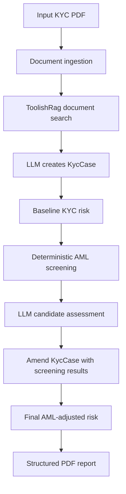

# KYC AML Risk Assessment Agent Skill

MUST generate `KYCAMLRiskAssessmentAgent` using the instructions below.

The generated agent MUST ingest customer documents, construct a structured
`KycCase`, perform AML screening, amend the case with screening evidence,
recompute risk, and generate a structured report.

## Type References

Use these local ontology files as the contract for structured output and AML
screening integration:

- KYC types: `meta-agent-service/src/test/kotlin/com/embabel/metaagent/kycdemo/KycDemoTypes.kt`
- AML screening types: `meta-agent-service/src/test/kotlin/com/embabel/metaagent/kycdemo/screening/AmlTypes.kt`

Do not duplicate these types in prompts, tests, or helper code. The framework can
derive the structured output schema from the Kotlin classes. Use examples only as
hints for shape and intent.

## Skill Goal

Create a KYC agent that can:

1. Ingest supplied KYC documents.
2. Extract a structured `KycCase`.
3. Compute baseline KYC risk from document evidence.
4. Screen the subject against AML providers.
5. Ask the LLM to assess ambiguous AML candidates when deterministic matching is
   insufficient.
6. Amend the `KycCase` with AML screening results and merge decisions.
7. Recompute final risk after AML enrichment.
8. Generate a structured PDF report that shows the input, extracted case,
   baseline risk, AML findings, final risk, and required analyst actions.

## Agent Responsibilities

The KYC extraction agent should use document evidence only. It should identify
the primary customer, extracted identifiers, addresses, ownership evidence,
document evidence, missing evidence, and initial recommendation.

The AML screening stage should not overwrite the KYC subject with a sanctions
candidate. It should attach screening results and merge rationale. Candidate
matches remain separate until a human analyst confirms the disposition.

The risk stage should run twice:

- before AML screening, using internal KYC evidence only
- after AML screening, replacing the pre-screening sanctions factor with AML
  screening evidence

## LLM Boundary

Use deterministic code for:

- parsing official sanctions files
- finding candidate records
- computing baseline string, identifier, country, and address evidence
- applying configured risk-score weights
- rendering reports

Use the LLM for:

- mapping unstructured KYC document evidence into `KycCase`
- explaining ambiguous candidate matches
- assigning candidate confidence when evidence conflicts or identifiers are
  missing
- producing analyst-readable rationale and missing-evidence lists

## Required Demo Pipeline



## Current Demo Entry Points

- Full KYC + AML pipeline test:
  `meta-agent-service/src/test/kotlin/com/embabel/metaagent/kycdemo/screening/KycAmlRiskPipelineIntegrationTest.kt`
- AML report README:
  `meta-agent-service/src/test/kotlin/com/embabel/metaagent/kycdemo/screening/README.md`
- Baseline risk methodology:
  `meta-agent-service/src/test/kotlin/com/embabel/metaagent/kycdemo/BaselineKycRiskMethodologyRule.kt`
- AML risk methodology:
  `meta-agent-service/src/test/kotlin/com/embabel/metaagent/kycdemo/screening/AmlRiskMethodology.kt`

## Configuration Notes

The demo currently uses OFAC SDN XML for real AML screening. Download the file
from OFAC and point the test to it:

```bash
AML_OFAC_SDN_XML=/path/to/sdn.xml
```

Official OFAC links:

- OFAC Sanctions List Service: https://ofac.treasury.gov/sanctions-list-service
- Direct SDN XML file: https://www.treasury.gov/ofac/downloads/sdn.xml
- Compressed SDN XML file: https://www.treasury.gov/ofac/downloads/sdn_xml.zip

Production code should externalize matching thresholds, country risk, scoring
weights, periodic review cadence, and provider source URLs.
