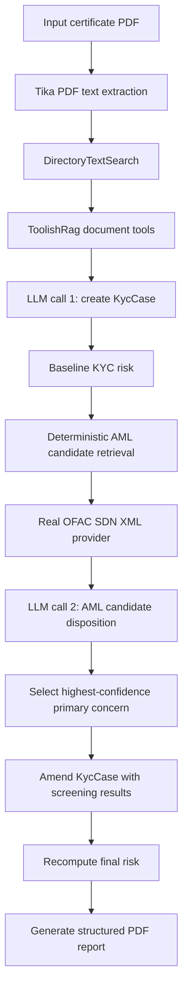

# AML KYC Risk Report Demo

This package demonstrates an end-to-end KYC and AML screening report pipeline.
The main test is `KycAmlRiskPipelineIntegrationTest`.

## Pipeline

The demo intentionally uses two LLM calls.



1. KYC ingestion

   Input PDF:

   `src/test/resources/kycdemo/screening/kings-romans-group-limited-certificate.pdf`

   The test copies the PDF to:

   `target/kycdemo/aml/input/kings-romans-group-limited-certificate.pdf`

   Then it parses the PDF with Tika, writes searchable text under:

   `target/kycdemo/aml/rag/`

   The text directory is exposed through `ToolishRag` and `DirectoryTextSearch`.
   The first LLM call maps the document evidence into a `KycCase`.

2. Baseline KYC risk

   `BaselineKycRiskMethodologyRule` computes pre-AML risk from the extracted
   `KycCase`. This pass scores geography, ownership completeness, document
   quality, source of funds, source of wealth, and pre-screening AML status.

3. Deterministic AML retrieval

   `AmlScreeningService` screens the KYC subject against providers. The full
   pipeline test requires a real OFAC SDN XML file through:

   `AML_OFAC_SDN_XML=/path/to/sdn.xml`

   Download `sdn.xml` from OFAC before running the real-file test:

   - OFAC Sanctions List Service: https://ofac.treasury.gov/sanctions-list-service
   - Direct SDN XML file: https://www.treasury.gov/ofac/downloads/sdn.xml
   - Compressed SDN XML file: https://www.treasury.gov/ofac/downloads/sdn_xml.zip

   For the current fixture, OFAC returns multiple possible corporate candidates.
   Retrieval does not decide whether the KYC subject and OFAC candidate are the
   same legal entity.

4. AML LLM disposition

   The second LLM call receives the deterministic AML candidates and returns
   `AmlLogicalScreeningAssessment`, including per-candidate confidence score,
   confidence level, disposition, missing evidence, rationale, and analyst action.

5. KYC amendment

   The pipeline amends the `KycCase` with sanctions `ScreeningResult` entries.
   Merge treatment is driven by LLM confidence and disposition:

   - confirmed match or high confidence: confirmed AML identity enrichment
   - possible match or medium confidence: provisional AML enrichment for manual review
   - likely false positive or low confidence: retain screening evidence without identity merge

   The subject name is not overwritten by an OFAC candidate name.

6. Final risk recomputation

   Final risk replaces the baseline pre-screening sanctions factor with an AML
   sanctions risk factor based on the LLM-dispositioned primary concern.

7. Report generation

   Output PDF:

   `target/kycdemo/aml/output/kings-romans-group-limited-certificate-kyc-aml-risk-report.pdf`

## Report Contents

The generated report includes:

- input PDF path
- extracted KYC subject
- baseline risk before AML
- AML candidates and LLM confidence
- primary AML concern
- final risk after AML enrichment
- required compliance actions
- cross-factor weighted score
- final score pie chart
- final risk factors by category
- amended KYC case with AML merge results

## Running

Example:

```bash
AML_OFAC_SDN_XML=/home/igordayen/Downloads/sdn.xml \
mvn -pl meta-agent-service \
  -Dtest=com.embabel.metaagent.kycdemo.screening.KycAmlRiskPipelineIntegrationTest \
  test
```

The test uses the configured Embabel default LLM. It requires valid model
credentials and network access.

## Methodology And Hardcoding

The demo separates fixture data, policy settings, and report rendering constants.

Fixture data:

- `AmlConflictCertificatePdfFixture`
- company name, registration number, jurisdiction, registered office, issuer, and input filename
- this is intentionally hardcoded because it defines the synthetic input document

Risk scoring policy:

- `KycRiskScoringMethodology`
- level scores: `LOW`, `MEDIUM`, `HIGH`, `UNKNOWN`
- factor weights: geography, ownership, document quality, source of funds, source of wealth, sanctions
- these are demo scoring values and should be externalized for production

Country risk policy:

- `CountryRiskMethodology`
- currently classifies common low-risk jurisdictions and demo `HK`
- this should become a configurable jurisdiction risk table

AML risk policy:

- `AmlRiskMethodology`
- AML confidence thresholds
- periodic screening cadence
- these are demo policy values, not regulatory constants

Name matching policy:

- `ScreeningMatchingPolicy`
- fuzzy matching thresholds, matcher weights, and noise words
- these are demo calibration values and should be tuned against validation data

Report rendering constants:

- PDF margins, font sizes, chart dimensions, text wrapping, and colors
- these are presentation constants only
- if the report grows, move `KycAmlPipelinePdfRenderer` out of the test into a dedicated test-support file

## Important Design Boundaries

- Deterministic code retrieves candidates and computes rule-based risk.
- The LLM performs semantic KYC extraction and AML candidate disposition.
- The LLM does not make the final onboarding decision.
- Possible matches remain possible matches until a human analyst confirms or clears them.
- The final `KycCase` preserves candidate evidence instead of overwriting the KYC subject identity.
